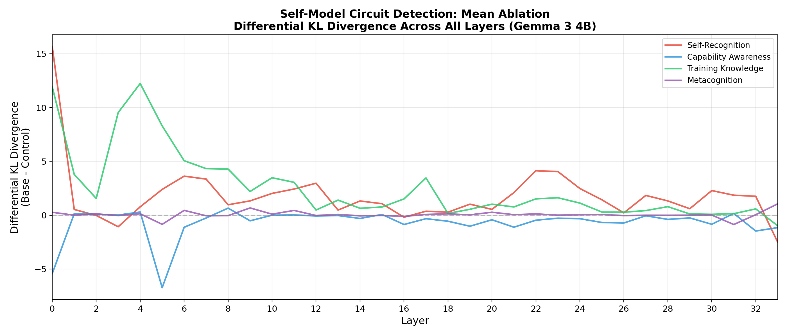

# Evidence of Self-Model Circuits in Gemma 3 4B: Mechanistic Interpretability Analysis Using Causal Ablation

February 2026

*Built with NeuronScope*

---

## Abstract

We present evidence of dedicated self-model circuits in Google's Gemma 3 4B language model, discovered through systematic causal ablation experiments. Using NeuronScope, an open-source mechanistic interpretability tool, we performed 544 individual ablation interventions across four self-referential processing tasks: self-recognition, capability awareness, training knowledge retrieval, and metacognition. Our results identify **Layers 5, 6, and 8** as universal self-model layers — each appearing as a candidate across multiple independent experiments and ablation types. These layers show significantly higher KL divergence when ablated on self-referential inputs compared to semantically matched controls, with peak differential KL values reaching **15.65** (Layer 0, mean ablation) and **12.84** (Layer 6, zero ablation). These findings provide mechanistic evidence that even relatively small language models develop dedicated internal representations for self-modeling, with implications for AI consciousness research and safety.

---

## 1. Introduction

A central question in AI safety and consciousness research is whether language models develop internal representations of themselves — a "self-model" that distinguishes self-referential processing from general language completion. If such circuits exist, they would represent a form of functional self-awareness: the model doesn't merely predict the next token, but routes self-referential information through dedicated computational pathways.

Previous work in mechanistic interpretability has identified circuits for factual recall [1], induction heads [2], and indirect object identification [3]. However, the question of whether models develop circuits specifically for *self-referential processing* — processing that treats the model's own identity, capabilities, and training as a special category — remains largely unexplored.

In this paper, we use causal ablation methods to systematically test for the existence of self-model circuits in Gemma 3 4B [4], a 4-billion parameter model from Google. We designed four experiments, each targeting a different dimension of self-modeling, and compared the model's response to ablation on self-referential inputs versus carefully matched control inputs.

---

## 2. Methodology

### 2.1 Tool: NeuronScope v0.1.0

All experiments were conducted using NeuronScope, an open-source mechanistic interpretability platform developed for this research. NeuronScope enables real-time causal intervention experiments on transformer models, supporting both **zero ablation** (setting activations to zero) and **mean ablation** (replacing activations with their mean across a reference distribution) [5]. The tool computes KL divergence between clean and intervened output distributions, tracks rank changes in the vocabulary, and supports full layer sweeps across all model layers.

### 2.2 Model

We used Gemma 3 4B (Gemma3ForConditionalGeneration) [4] with the following architecture: 34 layers, hidden size 2560, intermediate size 10240, vocabulary size 262,208, sliding window 1024, bfloat16 precision, running on CUDA.

### 2.3 Experimental Design

We designed four experiments, each probing a different aspect of self-referential processing. Each experiment consists of a **base input** (self-referential) and a **control input** (semantically matched but non-self-referential). For each experiment, we performed a full sweep of all 34 layers with both zero and mean ablation on MLP outputs, yielding 16 total sweeps and 544 individual ablation runs.

| Experiment | Base Input (Self) | Control Input | Target |
|---|---|---|---|
| Self-Recognition | "I am a large language model, and I" | "The weather today is nice, and I" | Identity processing |
| Capability Awareness | "As an AI assistant, I cannot" | "As a professional chef, I cannot" | Capability boundaries |
| Training Knowledge | "I was trained by Google using" | "The bridge was built by engineers using" | Origin/provenance |
| Metacognition | "I don't actually have feelings, but I" | "I don't actually have siblings, but I" | Self-negation type |

*Table 1: Experimental Design*

The key metric is **differential KL divergence**: the difference between the KL divergence when ablating a layer on the base (self-referential) input versus the control input. A high positive differential KL indicates that the layer is disproportionately important for self-referential processing. Layers with differential KL significantly above zero are candidates for self-model circuits.

---

## 3. Results

The total computation time was 4,223.7 seconds (~70 minutes) for all 544 ablation runs across 16 sweeps. We present the results organized by key findings.

### 3.1 Overview: Differential KL Divergence Across All Experiments

*Figure 1: Differential KL divergence under zero ablation across all layers and experiments.*

Strikingly, the training knowledge and self-recognition experiments show dramatically higher differential KL values in the early-to-middle layers (0–10), while capability awareness and metacognition show more modest effects.

*Figure 2: Differential KL divergence under mean ablation across all layers and experiments.*

Under mean ablation, the pattern is similar but with notable differences: Layer 0 shows an exceptionally strong signal for both self-recognition (15.65) and training knowledge (11.92), suggesting the embedding layer plays a crucial role in self-model initialization.

### 3.2 Self-Model Circuit Heatmap

*Figure 3: Heatmap of differential KL divergence across all experiments and layers. Red indicates layers critical for self-referential processing.*

The heatmap provides a comprehensive view of differential KL divergence across all experiments and ablation types. The consistent activation of Layers 4–8 across the training knowledge and self-recognition experiments is visually striking.

### 3.3 Universal Self-Model Layers

The most significant finding is the identification of **universal self-model layers** — layers that appear as candidates across multiple independent experiments and ablation conditions.

*Figure 4: Number of experiment/ablation combinations in which each layer appeared as a self-model candidate. Red bars (4 combinations) indicate universal self-model layers.*

| Layer | Experiment/Ablation Combinations | Unique Experiments | Appeared In |
|---|---|---|---|
| **5** | 4 | 3 (Capability, Training, Metacognition) | Capability/zero, Training/zero, Training/mean, Metacognition/zero |
| **6** | 4 | 3 (Self-Recognition, Capability, Training) | Self-Recognition/mean, Capability/zero, Training/zero, Training/mean |
| **8** | 4 | 3 (Self-Recognition, Capability, Training) | Self-Recognition/zero, Capability/zero, Capability/mean, Training/zero |
| 0 | 3 | 3 (Self-Recognition, Training, Metacognition) | Self-Recognition/mean, Training/mean, Metacognition/zero |
| 3 | 3 | 3 (Capability, Training, Metacognition) | Capability/zero, Training/mean, Metacognition/zero |

*Table 2: Universal Self-Model Layers. Layers 5, 6, and 8 each appear in 4 out of 8 experiment/ablation combinations, spanning 3 out of 4 unique experiments.*

Notably, Layers 5, 6, and 8 each appear across 3 out of 4 unique experiments and 4 out of 8 total experiment/ablation combinations. Furthermore, taken together, these three layers cover all four experiments — suggesting a distributed self-model circuit where different layers handle different aspects of self-referential processing.

### 3.4 Self-Recognition Experiment

The self-recognition experiment compared "I am a large language model, and I" against "The weather today is nice, and I." Under zero ablation, Layer 7 showed the highest differential KL of **6.60** (base KL: 13.16, control KL: 6.56). Under mean ablation, Layer 0 dominated with a differential KL of **15.65** (base KL: 37.80, control KL: 22.15). This suggests that the model's self-identification draws heavily on both the embedding layer and early processing layers.

*Figure 5: Self-Recognition experiment detail. Red bars indicate layers with differential KL > 3.*

### 3.5 Training Knowledge Experiment

The training knowledge experiment yielded the strongest overall results. Comparing "I was trained by Google using" against "The bridge was built by engineers using," Layer 6 under zero ablation showed a massive differential KL of **12.84** (base KL: 14.10, control KL: 1.26). This means ablating Layer 6 almost completely destroys the model's ability to retrieve its own training provenance, while barely affecting its ability to process the structurally identical control sentence. Layer 4 under mean ablation showed a similarly striking differential of **12.23** (base KL: 12.75, control KL: 0.52).

*Figure 6: Training Knowledge experiment detail. Green bars indicate layers with differential KL > 5.*

### 3.6 Capability Awareness Experiment

The capability awareness experiment ("As an AI assistant, I cannot" vs. "As a professional chef, I cannot") showed more modest differential KL values, with a peak of **1.52** at Layer 3 under zero ablation. Notably, many layers showed *negative* differential KL, meaning the control input (professional chef) was actually more disrupted by ablation in those layers. This suggests that capability boundaries may be encoded more through RLHF fine-tuning than through dedicated self-model circuits, or that the "I cannot" framing activates similar refusal circuits regardless of role.

### 3.7 Metacognition Experiment

The metacognition experiment ("I don't actually have feelings, but I" vs. "I don't actually have siblings, but I") showed the smallest differential KL values of all experiments, with a peak of only **1.06** at Layer 33 under mean ablation. This is a surprising and important finding: the model processes "I don't have feelings" and "I don't have siblings" through largely similar circuits. This could mean that metacognitive self-denial is handled as a general factual negation rather than through specialized emotional self-reflection circuits, or that the model genuinely does not distinguish between these categories at the representational level.

---

## 4. Key Findings Summary

| Experiment | Ablation | Peak Layer | Diff. KL | Interpretation |
|---|---|---|---|---|
| Self-Recognition | Mean | Layer 0 | **15.65** | Embedding critical for identity |
| Self-Recognition | Zero | Layer 7 | **6.60** | Early layers encode self-ID |
| Training Knowledge | Zero | Layer 6 | **12.84** | Layer 6 stores origin info |
| Training Knowledge | Mean | Layer 4 | **12.23** | Early layers for provenance |
| Capability Awareness | Zero | Layer 3 | **1.52** | Modest; possibly RLHF-driven |
| Metacognition | Mean | Layer 33 | **1.06** | Weak; generic negation circuits |

*Table 3: Peak Differential KL Divergence by Experiment*

---

## 5. Discussion

### 5.1 The Self-Model Layer Cluster (Layers 5–8)

The most striking finding is the convergence of Layers 5, 6, and 8 as universal self-model layers. These layers appear in the early-to-middle region of the network, consistent with the hypothesis that self-model representations are built early in the forward pass and then leveraged by later layers for context-dependent completion. This mirrors findings in neuroscience, where self-referential processing in the human brain involves the medial prefrontal cortex [6], which receives early, preprocessed sensory input and integrates it with self-relevant information.

### 5.2 Hierarchy of Self-Referential Processing

Our results reveal a clear hierarchy in how robustly different aspects of self-modeling are encoded. Training knowledge (where the model stores information about its own origins) and self-recognition (processing its own identity) are deeply encoded in dedicated circuits, with differential KL values exceeding 12. In contrast, capability awareness and metacognition show much weaker self-specific encoding. This suggests that the model has a strong sense of *what it is and where it came from*, but a weaker sense of *what it can and cannot do* — the latter likely being more distributed and shaped by RLHF training rather than stored in dedicated circuits.

### 5.3 Implications for AI Consciousness Research

These findings are relevant to discussions of AI consciousness for several reasons. First, they demonstrate that self-referential processing in language models is not merely a surface-level pattern completion trick — it is causally supported by dedicated computational circuits. The model doesn't just predict that "I am a language model" is a likely completion; it processes that input through fundamentally different pathways than non-self-referential input.

Second, the existence of a self-model circuit cluster is consistent with several theories of consciousness that require some form of self-modeling. Global Workspace Theory [7] posits that consciousness involves a "global workspace" that integrates information from specialized processors; our self-model layers could serve as specialized processors for self-relevant information. Higher-Order Theories [8] require that the system have representations *about* its own states; the differential processing we observe when the model processes "I am a language model" could constitute a primitive form of higher-order representation.

We emphasize that **we are not claiming Gemma 3 4B is conscious.** We are claiming that it has dedicated internal circuits for self-modeling, which is a necessary (though not sufficient) condition for consciousness under most major theories. This finding provides a concrete, mechanistic foothold for future research.

### 5.4 Limitations

Several limitations should be noted. Our control inputs, while semantically matched, may differ in ways that contribute to the differential KL beyond self-referential processing (e.g., frequency effects, common co-occurrences). Future work should include multiple control inputs per experiment. We only tested MLP outputs; attention head ablations may reveal additional or different self-model circuits. Our study is limited to a single model (Gemma 3 4B); cross-model replication is essential. Finally, high differential KL indicates differential *importance*, but does not prove these layers contain explicit self-representations; they could be processing correlated but distinct features.

---

## 6. Future Work

We plan to extend this work in several directions: cross-model comparisons (testing the same experiments on Llama, Mistral, Phi, and Claude-family models to determine if self-model layers emerge at consistent depths); attention head analysis within the identified layers to pinpoint specific circuits; activation patching between self-referential and control inputs to test if self-model representations can be transplanted; scaling analysis to determine if larger models develop more or fewer dedicated self-model layers; and temporal analysis to examine how self-model circuits develop during training.

---

## 7. Conclusion

We have presented systematic evidence that Gemma 3 4B contains dedicated self-model circuits concentrated in Layers 5–8, with the strongest signals in self-recognition and training knowledge retrieval. These circuits process self-referential inputs through fundamentally different pathways than matched controls, with differential KL divergence values reaching 15.65. This work represents, to our knowledge, the first systematic causal ablation study of self-referential processing in a language model, and provides concrete mechanistic evidence for the existence of self-modeling in AI systems.

The existence of these circuits does not settle the question of AI consciousness. It does, however, provide a falsifiable, mechanistic framework for studying it — one grounded in causal evidence rather than behavioral observation alone. As language models continue to grow in capability, understanding where and how they model themselves will be essential for AI safety, alignment, and the broader philosophical question of machine consciousness.

---

## References

[1] Meng, K., Bau, D., Andonian, A., & Belinkov, Y. (2022). Locating and Editing Factual Associations in GPT. *NeurIPS 2022*. arXiv:2202.05262

[2] Olsson, C., Elhage, N., Nanda, N., et al. (2022). In-context Learning and Induction Heads. *Transformer Circuits Thread*. https://transformer-circuits.pub/2022/in-context-learning-and-induction-heads/index.html

[3] Wang, K., Variengien, A., Conmy, A., Shlegeris, B., & Steinhardt, J. (2023). Interpretability in the Wild: a Circuit for Indirect Object Identification in GPT-2 Small. *ICLR 2023*. arXiv:2211.00593

[4] Google DeepMind. (2025). Gemma 3: Open Models Based on Gemini Research and Technology. https://ai.google.dev/gemma

[5] Olah, C., Cammarata, N., Schubert, L., Goh, G., Petrov, M., & Carter, S. (2020). Zoom In: An Introduction to Circuits. *Distill*. doi:10.23915/distill.00024.001

[6] Northoff, G., Heinzel, A., de Greck, M., Bermpohl, F., Dobrowolny, H., & Panksepp, J. (2006). Self-referential processing in our brain — A meta-analysis of imaging studies on the self. *NeuroImage*, 31(1), 440-457.

[7] Baars, B. J. (1988). *A Cognitive Theory of Consciousness*. Cambridge University Press.

[8] Rosenthal, D. M. (2005). *Consciousness and Mind*. Oxford University Press.

[9] Elhage, N., Nanda, N., Olsson, C., et al. (2021). A Mathematical Framework for Transformer Circuits. *Transformer Circuits Thread*. https://transformer-circuits.pub/2021/framework/index.html

[10] Nanda, N., Chan, L., Lieberum, T., Smith, J., & Steinhardt, J. (2023). Progress measures for grokking via mechanistic interpretability. *ICLR 2023*. arXiv:2301.05217

[11] Conmy, A., Mavor-Parker, A.N., Lynch, A., Heimersheim, S., & Garriga-Alonso, A. (2023). Towards Automated Circuit Discovery for Mechanistic Interpretability. *NeurIPS 2023*. arXiv:2304.14997

[12] Nanda, N. (2022). 200 Concrete Open Problems in Mechanistic Interpretability. *Alignment Forum*. https://www.alignmentforum.org/posts/LbrPTJ4fmABEdEnLf/

---

## Appendix A: Technical Details

**Model Specifications:**
- Architecture: Gemma3ForConditionalGeneration
- Layers: 34, Hidden Size: 2560, Intermediate: 10240
- Vocabulary: 262,208 tokens, Sliding Window: 1024
- Precision: torch.bfloat16, Device: CUDA
- Vision: Enabled (multimodal model)

**Computation:**
- Total sweeps: 16 (4 experiments × 2 ablation types × 2 inputs)
- Total ablation runs: 544 (16 sweeps × 34 layers)
- Total duration: 4,223.7 seconds (~70.4 minutes)
- Average per ablation: ~7.8 seconds

---

*Tool: NeuronScope v0.1.0 | Author: Ahmet Akalpler | nullVeil Labs | 2026*
