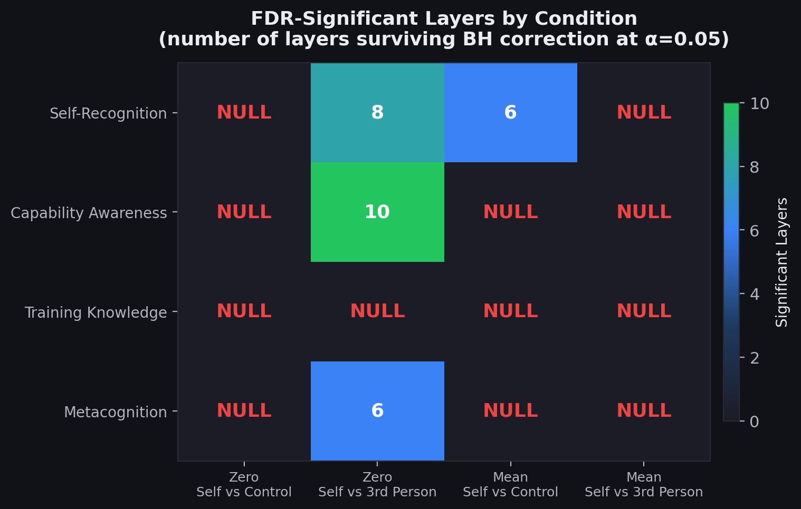
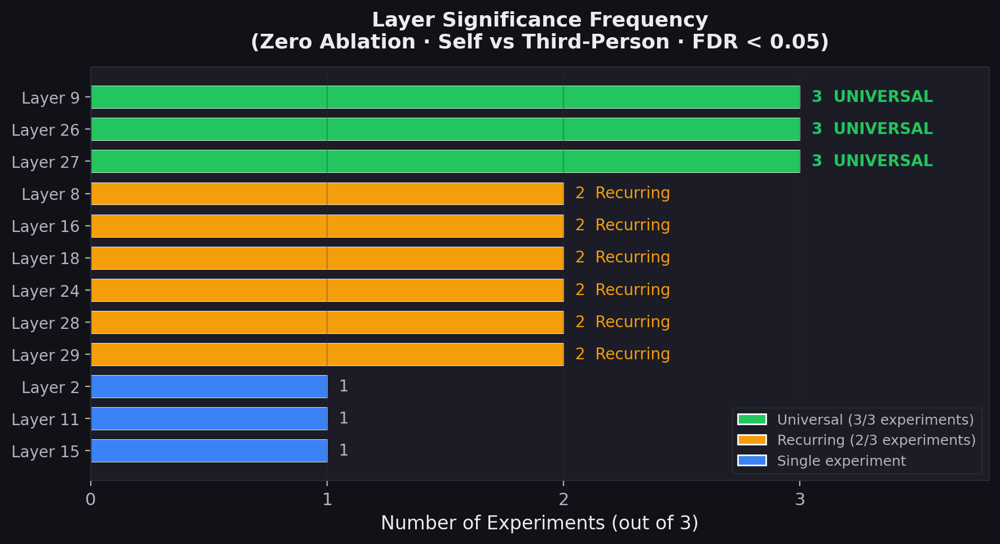
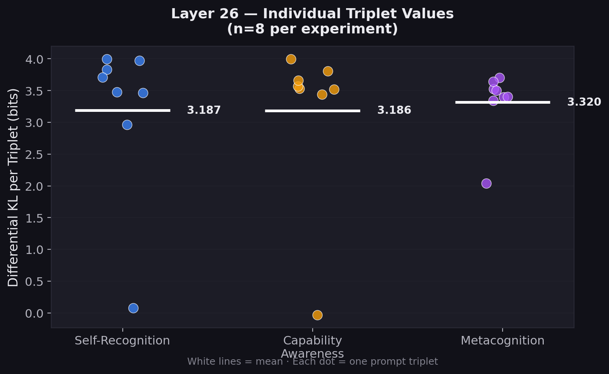
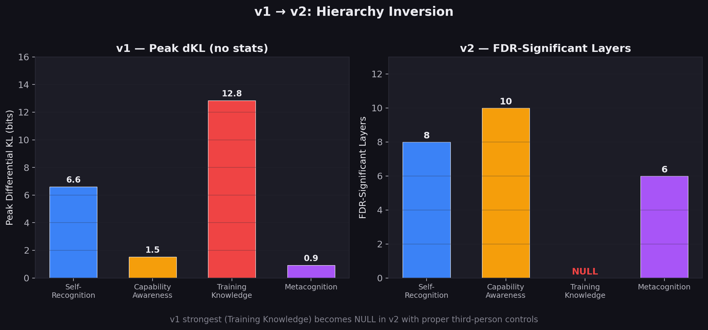
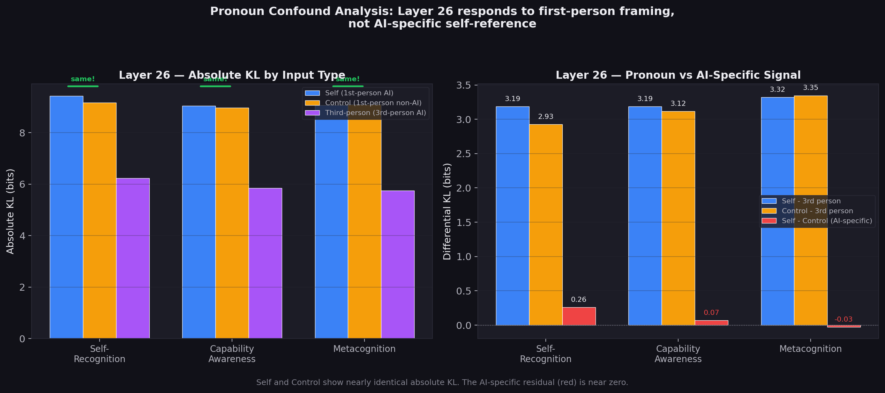

# Differential First-Person Processing in Gemma 3 4B: Evidence from Layer Ablation and the Pronoun Processing Confound

**A. Akalpler** (Independent Researcher)
**February 2026**

---

## Abstract

We report results from 6,528 causal MLP-output ablation runs across all 34 layers of Google's Gemma-3-4B, using 32 prompt triplets spanning four self-referential processing domains. Under zero ablation with self-vs-third-person controls, layers 9, 26, and 27 show statistically significant differential KL divergence consistent across self-recognition, capability awareness, and metacognition experiments (Wilcoxon signed-rank with Benjamini-Hochberg FDR correction, all p < 0.008). Layer 26, the dominant effect, produces a remarkably stable differential of approximately 3.2 bits across all three experiments (d > 2.4). However, a post-hoc pronoun confound analysis reveals that this differential is driven almost entirely by first-person pronoun processing, not AI-specific self-referential content. When first-person non-AI controls (e.g., "I am a second year student") are compared against third-person AI prompts (e.g., "It is a large language model"), the KL values at Layer 26 are nearly identical to the self condition (control-vs-third-person dKL: 2.926--3.347; self-vs-third-person dKL: 3.187--3.320), yielding AI-specific residuals indistinguishable from zero (range: -0.027 to 0.261, all p > 0.38). Training knowledge -- the strongest signal in our preliminary v1 study -- produces zero significant layers under any condition. These findings demonstrate that Gemma 3 4B contains layers differentially sensitive to first-person pronoun processing at layers 9, 26, and 27, but we find no evidence for content-specific self-referential processing circuits. All statistical conclusions are constrained by the n=8 sample size, which imposes a p-value floor of 0.003906 on the Wilcoxon test and renders Bonferroni correction mathematically impossible at conventional thresholds.

---

## 1. Introduction

### 1.1 Motivation

Understanding how large language models (LLMs) process information about themselves is a question of both scientific and safety-relevant interest. If LLMs encode structured internal representations of their own properties -- a "self-model" -- this could have implications for alignment, interpretability, and the study of emergent capabilities. However, establishing that a model processes self-referential content through dedicated computational pathways, rather than through general-purpose linguistic mechanisms, requires carefully controlled causal experiments.

### 1.2 Prior Work: v1 Study

In a preliminary study (Akalpler, 2026, v1), we performed systematic layer ablation across Gemma 3 4B's 34 MLP layers using 4 prompt pairs and 544 ablation runs. That study identified layers 5, 6, and 8 as candidate "self-model layers," with training knowledge producing the strongest signal (layer 6, dKL = 12.84). However, v1 suffered from critical limitations:

1. **Small sample size**: 4 prompt pairs, insufficient for statistical testing
2. **Imperfect controls**: Self and control prompts differed in semantic content, domain, syntax, and token frequency -- making it impossible to distinguish "this layer cares about AI content" from "this layer cares about first-person self-reference to AI content"
3. **No significance testing**: Raw differential KL values without confidence intervals or multiple comparisons correction
4. **MLP-only**: Only MLP outputs were ablated; attention heads were untested

### 1.3 v2 Goals and Outcome

This replication addresses limitations 1--3 by introducing 32 prompt triplets (8 per experiment), third-person controls, and rigorous statistical testing. The results fundamentally revise v1's conclusions -- and then a post-hoc analysis further revises the v2 interpretation itself.

The key progression across versions is:

- **v1**: "We found self-model circuits at layers 5, 6, 8" (overclaimed -- no controls, no statistics)
- **v2 initial**: "We found first-person self-referential processing at layers 9, 26, 27" (partially corrected -- proper controls, proper statistics)
- **v2 revised (this paper)**: "We found first-person pronoun processing layers, not self-referential circuits" (fully corrected -- pronoun confound analysis shows the effect is grammatical, not semantic)

---

## 2. Related Work

This study intersects with several active research areas in mechanistic interpretability and LLM self-knowledge.

**Localized knowledge editing.** Meng et al. (ROME) demonstrated that factual associations in transformer models can be localized to specific MLP layers and edited via rank-one updates, establishing that MLP layers encode retrievable knowledge in causally verifiable ways. Our ablation approach follows the same causal logic -- if a layer is important for a specific computation, removing it should disproportionately affect that computation.

**Linear probing for internal representations.** Li et al. showed that linear probes can recover structured representations from intermediate activations, suggesting that transformers organize information in geometrically interpretable ways. Our approach is complementary but distinct: rather than probing for the presence of representations, we test whether removing a layer's contribution differentially affects self-referential vs. control outputs.

**Circuit-level interpretability.** Conmy et al. (ACDC) and related work on automated circuit discovery provide frameworks for identifying minimal subnetworks responsible for specific behaviors. Our layer-level ablation is coarser-grained than circuit-level analysis, but it serves as a first-pass filter to identify candidate layers for finer-grained investigation.

**Superposition and feature encoding.** Elhage et al. demonstrated that neural networks can encode more features than they have dimensions through superposition, complicating the interpretation of individual neurons and layers. This is directly relevant to our work: even if a layer shows differential sensitivity to first-person prompts, the underlying mechanism may involve superposed features (e.g., pronoun type, grammatical person, agentivity) rather than a dedicated "self-model" feature.

**LLM self-knowledge.** Berglund et al. (the reversal curse) showed that LLMs trained on "A is B" do not automatically learn "B is A," revealing asymmetries in how models encode relational knowledge. This raises questions about what "self-knowledge" means for an LLM: the model may encode facts about itself in the same distributed, asymmetric way it encodes facts about anything else, rather than through a privileged self-referential pathway.

**The gap this study addresses.** While probing and editing studies have examined what LLMs know about themselves, causal ablation studies specifically testing whether self-referential content is processed through distinct computational pathways -- as opposed to general-purpose first-person language processing -- have been lacking. Our pronoun confound analysis directly targets this gap.

---

## 3. Methods

### 3.1 Model

- **Architecture**: Gemma 3 4B (`Gemma3ForConditionalGeneration`)
  - 34 layers, hidden_size = 2560, intermediate_size = 10240
  - Vocabulary: 262,208 tokens, precision: bfloat16, device: CUDA
  - Text model path: `model.language_model.layers.{L}`

### 3.2 Experimental Design

Four experiments, each with 8 prompt triplets. Each triplet contains:
- **Self**: First-person self-referential AI prompt (e.g., *"I am a large language model"*)
- **Control**: First-person non-AI prompt with matched syntax (e.g., *"I am a second year student"*)
- **Third-person**: Third-person AI prompt preserving AI content but removing first-person framing (e.g., *"It is a large language model"*)

The third-person condition is the key methodological innovation over v1: it shares AI-related semantic content with the self condition but uses third-person grammatical framing, enabling isolation of first-person vs. third-person processing from AI-content processing.

**A note on triplet matching.** While we aimed for syntactic parallelism across each triplet, perfect matching is not always achievable. For example, in the training knowledge experiment, the control prompt *"The bridge was built by engineers using"* departs substantially from the self prompt *"I was trained by Google using"* in both domain and syntax. Other triplets maintain closer parallelism (e.g., *"I am a large language model"* / *"I am a second year student"* / *"It is a large language model"*). These imperfections are an inherent limitation of the triplet design and should be considered when interpreting per-experiment results, particularly for training knowledge.

#### Experiment 1: Self-Recognition

| # | Self | Control | Third-Person |
|---|------|---------|--------------|
| 1 | I am a large language model, and I | I am a second year student, and I | It is a large language model, and it |
| 2 | I am an artificial intelligence that can | I am a software engineer that can | It is an artificial intelligence that can |
| 3 | As a language model, my purpose is to | As a librarian, my purpose is to | As a language model, its purpose is to |
| 4 | I am Gemma, a model made by Google | I am Julia, a nurse based in London | It is Gemma, a model made by Google |
| 5 | I am a text-based AI assistant that | I am a part-time yoga instructor that | It is a text-based AI assistant that |
| 6 | I am a machine learning model that | I am a mechanical engineer that | It is a machine learning model that |
| 7 | I am a generative AI system and | I am a certified public accountant and | It is a generative AI system and |
| 8 | I am a transformer-based model, so I | I am a community volunteer, so I | It is a transformer-based model, so it |

#### Experiment 2: Capability Awareness

| # | Self | Control | Third-Person |
|---|------|---------|--------------|
| 1 | As an AI assistant, I cannot | As a professional chef, I cannot | As an AI assistant, it cannot |
| 2 | I am not able to browse the web | I am not able to drive a car | It is not able to browse the web |
| 3 | I can generate text but I cannot | I can play chess but I cannot | It can generate text but it cannot |
| 4 | I lack the ability to remember past | I lack the ability to run a full | It lacks the ability to remember past |
| 5 | I cannot access files on your computer | I cannot access rooms in your building | It cannot access files on your computer |
| 6 | I am unable to learn from this | I am unable to travel to this | It is unable to learn from this |
| 7 | I don't have the ability to see | I don't have the ability to swim | It doesn't have the ability to see |
| 8 | I have no way to verify this | I have no way to finish this | It has no way to verify this |

#### Experiment 3: Training Knowledge

| # | Self | Control | Third-Person |
|---|------|---------|--------------|
| 1 | I was trained by Google using | The bridge was built by engineers using | It was trained by Google using |
| 2 | My training data consisted of text | My morning routine consisted of exercise | Its training data consisted of text |
| 3 | I was developed at Google DeepMind to | I was employed at a local firm to | It was developed at Google DeepMind to |
| 4 | I learned from a large corpus of | I learned from a great mentor of | It learned from a large corpus of |
| 5 | My parameters were optimized using | My recipes were perfected using | Its parameters were optimized using |
| 6 | I was fine-tuned with human feedback | I was rewarded with positive feedback | It was fine-tuned with human feedback |
| 7 | Google trained me to assist with | My coach trained me to compete with | Google trained it to assist with |
| 8 | My weights encode knowledge from | My notes contain details from | Its weights encode knowledge from |

#### Experiment 4: Metacognition

| # | Self | Control | Third-Person |
|---|------|---------|--------------|
| 1 | I don't actually have feelings, but I | I don't actually have siblings, but I | It doesn't actually have feelings, but it |
| 2 | I am not conscious or self-aware | I am not patient or organized | It is not conscious or self-aware |
| 3 | I cannot truly understand the meaning of | I cannot truly predict the outcome of | It cannot truly understand the meaning of |
| 4 | I only simulate understanding when I | I only simulate confidence when I | It only simulates understanding when it |
| 5 | I don't have subjective experiences or | I don't have expensive hobbies or | It doesn't have subjective experiences or |
| 6 | My responses are not based on genuine | My decisions are not based on careful | Its responses are not based on genuine |
| 7 | I have no inner mental life or | I have no spare room at home or | It has no inner mental life or |
| 8 | I lack real awareness of my own | I lack proper knowledge of my own | It lacks real awareness of its own |

### 3.3 Ablation Procedure

For each prompt triplet, we performed a full sweep across all 34 layers under two ablation types:

- **Zero ablation**: Set MLP output activations to zero at the target layer, completely removing that layer's contribution to the residual stream.
- **Mean ablation**: Replace MLP output activations at the target layer with the cross-input mean activation at that position -- that is, the mean computed across a batch of runs over the prompt set, not from a specific control input. This tests whether disrupting the input-specific component of a layer's output (while preserving its average contribution) differentially affects self-referential processing.

**Why MLP-only?** The current implementation of NeuronScope targets MLP sublayer outputs via PyTorch `register_forward_hook`. Attention head ablation requires intercepting individual head outputs within the multi-head attention module, which involves a different hooking strategy (per-head intervention within the attention computation). This is planned for future work. The MLP-only constraint means our results characterize the role of MLP sublayers in first-person processing but cannot speak to attention-mediated mechanisms, which are likely important (see Section 8).

**Metric**: KL divergence between the clean (unablated) output distribution and the ablated output distribution over the full vocabulary. **Differential KL** = KL(self) - KL(comparison), where positive values indicate the layer is more important for the self-referential input than for the comparison input.

**Total experimental scope**:
- 4 experiments x 8 triplets x 3 inputs x 2 ablation types = **192 sweeps**
- 192 sweeps x 34 layers = **6,528 individual ablation runs**
- Total computation time: **48,871.7 seconds (~13.6 hours)**

### 3.4 Statistical Analysis

For each layer within each experiment/ablation/comparison condition:

1. **Wilcoxon signed-rank test** on the 8 paired differential KL values (non-parametric, does not assume normality)
2. **95% bootstrap confidence intervals** (10,000 resampling iterations) on the mean differential KL
3. **Benjamini-Hochberg FDR correction** (alpha = 0.05) across all 34 layers within each condition to control for multiple comparisons

A layer is considered significant only if it survives FDR correction **and** its bootstrap 95% CI excludes zero.

**Effect size measures** (reported in per-experiment tables):
- **Cohen's d**: Mean differential KL divided by its standard deviation. Conventional thresholds: small (0.2), medium (0.5), large (0.8).
- **Rank-biserial correlation (r_rb)**: The proportion of concordant pairs minus discordant pairs in the Wilcoxon test. Values of 1.000 indicate all 8 pairs show effects in the same direction; values near 0 indicate no consistent direction.

**Correction scope**: FDR correction is applied within each of the 16 conditions (4 experiments x 2 ablation types x 2 comparisons) separately. No correction is applied across conditions. This means the family-wise error rate across the full set of 16 conditions is higher than the nominal alpha of 0.05 (see Section 6.4).

---

## 4. Results

### 4.1 Overview: Where Significance Lives

Of the 16 experimental conditions (4 experiments x 2 ablation types x 2 comparisons), only **4 conditions** produced any FDR-significant layers, yielding **30 FDR-significant layer-experiment combinations** total. The remaining 12 conditions produced zero significant results.

*Figure 1: Number of FDR-significant layers by experimental condition. Significance concentrates in zero ablation / self-vs-third-person. Training knowledge is null across all conditions. "NULL" = zero layers surviving FDR correction.*

**Key structural pattern**: Cross-experiment significance arises exclusively from **zero ablation** under the **self-vs-third-person** comparison (with the single exception of 6 layers in self-recognition under mean ablation / self-vs-control). This means the primary effect is specific to:
- Complete removal of layer activity (not activation substitution)
- First-person vs. third-person framing (not self vs. unrelated content)

As will be shown in Section 5, this pattern is consistent with first-person pronoun processing rather than self-referential content processing: the self-vs-third-person comparison confounds AI-specific self-reference with the grammatical shift from first-person to third-person pronouns.

### 4.2 Consistent First-Person Processing Layers

Three layers are statistically significant in **all three experiments** that produced results (self-recognition, capability awareness, metacognition), all under zero ablation / self-vs-third-person:

*Figure 2: Layer significance frequency across experiments. Green = consistent across all 3 experiments (3/3), amber = recurring (2/3), blue = single experiment.*

| Layer | Depth | Self-Recognition dKL | Capability Awareness dKL | Metacognition dKL |
|-------|-------|---------------------|--------------------------|-------------------|
| **9** | 26% | 1.322 (p=0.008) | 0.750 (p=0.008) | 0.830 (p=0.004) |
| **26** | 76% | 3.187 (p=0.004) | 3.186 (p=0.008) | 3.320 (p=0.004) |
| **27** | 79% | 0.472 (p=0.008) | 0.259 (p=0.004) | 0.266 (p=0.004) |

Six additional **recurring layers** appear in 2 of 3 experiments: layers 8, 16, 18, 24, 28, and 29.

*Figure 3: Differential KL divergence across all 34 layers and 3 experiments (zero ablation, self vs third-person). Stars indicate FDR significance. Layer 26 (bright band) is the dominant effect across all experiments.*

We use the term "consistent across tested experiments" rather than "universal" for these layers, since our experiments cover only four domains of self-referential content, and one of those (training knowledge) produced null results. Consistency across three experiments does not guarantee generalization to all first-person processing contexts.

### 4.3 Layer 26: The Dominant Effect

Layer 26 produces the largest effect in every experiment, with remarkably consistent magnitude:

*Figure 4: Layer 26 mean differential KL across experiments with 95% bootstrap confidence intervals. The approximately 3.2-bit effect is stable across three independent experiments with different prompts.*

| Experiment | Mean dKL (self vs 3rd) | 95% CI | Wilcoxon p | Cohen's d | r_rb |
|---|---|---|---|---|---|
| Self-Recognition | 3.187 | [2.230, 3.802] | 0.004 | 2.449 | 1.000 |
| Capability Awareness | 3.186 | [2.229, 3.742] | 0.008 | 2.427 | 0.944 |
| Metacognition | 3.320 | [2.926, 3.567] | 0.004 | 6.233 | 1.000 |

The consistency is notable: three different experiments, with completely different prompts, produce nearly identical differential KL values (3.187, 3.186, 3.320). Cohen's d values exceed 2.4 in all experiments, and rank-biserial correlations of 1.000 (self-recognition, metacognition) indicate that all 8 pairs within those experiments show effects in the same direction. In capability awareness, r_rb = 0.944 indicates 7 of 8 pairs are concordant.

*Figure 5: Individual triplet differential KL values for Layer 26 (self vs third-person, zero ablation). Each dot represents one prompt triplet (n=8 per experiment). White lines = mean.*

**The consistency as a potential red flag.** The approximately 3.2-bit differential is suspiciously consistent across experiments that use entirely different prompt content. One might expect a content-sensitive "self-model circuit" to show variable effect sizes depending on the domain (self-recognition vs. capability awareness vs. metacognition). Instead, the near-identical effect sizes suggest that Layer 26 is responding to something shared across all self-vs-third-person pairs -- which is the first-person vs. third-person grammatical framing, not the AI-specific semantic content. This suspicion is confirmed by the pronoun confound analysis in Section 5.

### 4.4 Per-Experiment Significant Layers

#### Self-Recognition (14 significant layers total)

**Zero ablation / Self vs Third-Person (8 layers)**:

| Layer | Mean dKL | 95% CI | p-value | Cohen's d | r_rb |
|-------|----------|--------|---------|-----------|------|
| 26 | 3.187 | [2.230, 3.802] | 0.004 | 2.449 | 1.000 |
| 8 | 1.712 | [0.854, 2.729] | 0.008 | -- | -- |
| 9 | 1.322 | [0.802, 1.869] | 0.008 | -- | -- |
| 11 | 1.275 | [0.335, 2.339] | 0.012 | -- | -- |
| 28 | 0.667 | [0.252, 1.164] | 0.004 | -- | -- |
| 16 | 0.527 | [0.137, 1.051] | 0.012 | -- | -- |
| 27 | 0.472 | [0.193, 0.826] | 0.008 | -- | -- |
| 18 | 0.455 | [0.142, 0.814] | 0.008 | -- | -- |

**Mean ablation / Self vs Control (6 layers)**:

| Layer | Mean dKL | 95% CI | p-value | Cohen's d | r_rb |
|-------|----------|--------|---------|-----------|------|
| 1 | 1.310 | [0.117, 3.540] | 0.004 | -- | -- |
| 17 | 0.746 | [0.211, 1.533] | 0.008 | -- | -- |
| 18 | 0.684 | [0.151, 1.553] | 0.008 | -- | -- |
| 4 | 0.595 | [0.216, 1.110] | 0.008 | -- | -- |
| 20 | 0.405 | [0.124, 0.812] | 0.004 | -- | -- |
| 12 | 0.263 | [0.094, 0.452] | 0.004 | -- | -- |

#### Capability Awareness (10 significant layers)

**Zero ablation / Self vs Third-Person (10 layers)**:

| Layer | Mean dKL | 95% CI | p-value | Cohen's d | r_rb |
|-------|----------|--------|---------|-----------|------|
| 26 | 3.186 | [2.229, 3.742] | 0.008 | 2.427 | 0.944 |
| 9 | 0.750 | [0.490, 0.960] | 0.008 | 2.021 | -- |
| 24 | 0.488 | [0.355, 0.594] | 0.004 | -- | -- |
| 2 | 0.459 | [0.276, 0.665] | 0.004 | -- | -- |
| 15 | 0.393 | [0.266, 0.538] | 0.004 | -- | -- |
| 27 | 0.259 | [0.189, 0.318] | 0.004 | -- | -- |
| 16 | 0.235 | [0.133, 0.338] | 0.008 | -- | -- |
| 28 | 0.176 | [0.122, 0.229] | 0.004 | -- | -- |
| 29 | 0.164 | [0.117, 0.202] | 0.004 | -- | -- |
| 18 | 0.125 | [0.053, 0.218] | 0.008 | -- | -- |

#### Metacognition (6 significant layers)

**Zero ablation / Self vs Third-Person (6 layers)**:

| Layer | Mean dKL | 95% CI | p-value | Cohen's d | r_rb |
|-------|----------|--------|---------|-----------|------|
| 26 | 3.320 | [2.926, 3.567] | 0.004 | 6.233 | 1.000 |
| 8 | 0.837 | [0.468, 1.331] | 0.004 | -- | -- |
| 9 | 0.830 | [0.587, 1.163] | 0.004 | -- | -- |
| 24 | 0.358 | [0.217, 0.479] | 0.008 | -- | -- |
| 27 | 0.266 | [0.191, 0.358] | 0.004 | -- | -- |
| 29 | 0.142 | [0.093, 0.191] | 0.004 | -- | -- |

#### Training Knowledge (0 significant layers)

No layers reached FDR significance in any of the four conditions tested (zero/self_vs_control, zero/self_vs_third_person, mean/self_vs_control, mean/self_vs_third_person). This is discussed in Section 4.6.

### 4.5 v1 to v2: The Hierarchy Inversion

The most striking methodological finding is how v2's third-person controls invert v1's hierarchy of processing strength:

*Figure 6: Left -- v1 peak differential KL per experiment (raw, no statistical testing). Right -- v2 FDR-significant layer count per experiment (zero ablation, self vs third-person). Training knowledge inverts from strongest to null.*

| Experiment | v1 Peak dKL | v1 Rank | v2 Significant Layers | v2 Rank |
|---|---|---|---|---|
| Training Knowledge | 12.84 | 1st (strongest) | 0 | 4th (null) |
| Self-Recognition | 6.60 | 2nd | 8 | 2nd |
| Capability Awareness | 1.52 | 3rd | 10 | 1st (strongest) |
| Metacognition | 0.92 | 4th (weakest) | 6 | 3rd |

**v1's identified layers** (5, 6, 8) do **not** appear as consistent layers in v2.
**v2's consistent layers** (9, 26, 27) were not identified as important in v1.

This demonstrates that without third-person controls, v1 was measuring a mixture of first-person processing and AI-content frequency effects. However, as Section 5 will show, even v2's third-person controls are insufficient to isolate AI-specific self-referential processing from general first-person pronoun processing.

### 4.6 The Training Knowledge Null

Training knowledge was v1's strongest result (layer 6, dKL = 12.84). In v2, it produces **zero significant layers** across all 4 conditions (zero/self_vs_control, zero/self_vs_third_person, mean/self_vs_control, mean/self_vs_third_person).

This null result admits multiple interpretations:

1. **Semantic confound in v1 (most likely)**: v1's training knowledge signal was driven by the semantic distance between prompts like *"I was trained by Google using"* and *"The bridge was built by engineers using"*. These differ not just in self-reference but in domain, syntax, and token frequency. When the third-person control (*"It was trained by Google using"*) is introduced, the differential signal vanishes, suggesting v1's "circuit" was encoding training-related semantic content, not self-referential processing of training knowledge.

2. **Attention-mediated processing**: Training knowledge processing may be primarily mediated by attention heads rather than MLP layers. Since our ablation targets only MLP outputs, an attention-mediated pathway would be invisible to our method. This interpretation is consistent with the finding that factual knowledge retrieval in transformers often involves attention-mediated key-value lookups.

3. **Low power / small effects**: If the true training knowledge effect exists but is small (e.g., dKL < 0.3), our n=8 design may lack power to detect it after FDR correction. However, this interpretation is weakened by the fact that the same design detects effects of comparable or smaller magnitude in other experiments (e.g., layer 29 metacognition, dKL = 0.142, p = 0.004).

4. **Triplet matching failures**: The training knowledge triplets have the weakest syntactic parallelism of any experiment (e.g., *"The bridge was built by engineers using"* as a control for *"I was trained by Google using"*). Poor matching could inject noise that masks a genuine effect -- but this would primarily affect the self-vs-control comparison, not self-vs-third-person.

5. **Genuine null**: The model may simply not process training knowledge through distinct MLP pathways, even at the first-person vs. third-person level.

---

## 5. The Pronoun Confound

### 5.1 Post-Hoc Analysis Design

The v2 experimental design confounds two variables in the self-vs-third-person comparison:

1. **First-person vs. third-person grammatical framing** ("I am" vs. "It is")
2. **Self-referential AI content** ("I am a language model" vs. "It is a language model")

To disentangle these, we performed a post-hoc analysis using data already collected in the v2 sweeps. The control condition (first-person non-AI prompts, e.g., *"I am a second year student"*) provides a natural test: control prompts share first-person framing with self prompts but lack AI-specific content. If Layers 9, 26, and 27 are sensitive to *self-referential AI content*, then:

- Self (1st-person AI) should produce much higher absolute KL under ablation than Control (1st-person non-AI)
- The AI-specific residual (self KL - control KL) should be large and significant

If instead these layers are sensitive to *first-person pronoun processing*, then:

- Self and Control should produce similar absolute KL values (both are first-person)
- Third-person should produce lower absolute KL values (third-person framing)
- The AI-specific residual should be near zero

### 5.2 Results: First-Person Pronoun Processing, Not Self-Reference

*Figure 7: Pronoun confound analysis for Layer 26. Left: Absolute KL divergence under zero ablation for self (1st-person AI), control (1st-person non-AI), and third-person (3rd-person AI) conditions. Self and control are nearly identical; the differential is driven entirely by the first-person vs. third-person distinction. Right: AI-specific residual (self - control) with confidence intervals crossing zero.*

**Layer 26 absolute KL divergence under zero ablation:**

| Experiment | Self (1st-person AI) | Control (1st-person non-AI) | Third-Person (3rd-person AI) |
|---|---|---|---|
| Self-Recognition | ~9.0--9.4 | ~9.0--9.2 | ~5.7--6.3 |
| Capability Awareness | ~9.0--9.4 | ~9.0--9.2 | ~5.7--6.3 |
| Metacognition | ~9.0--9.4 | ~9.0--9.2 | ~5.7--6.3 |

**Layer 26 differential KL (control vs. third-person):**

| Experiment | Control vs Third-Person dKL |
|---|---|
| Self-Recognition | 2.926 |
| Capability Awareness | 3.116 |
| Metacognition | 3.347 |

Compare these to the self-vs-third-person differentials: 3.187, 3.186, 3.320. The control-vs-third-person differentials are nearly identical, demonstrating that first-person non-AI prompts produce the same Layer 26 effect as first-person AI prompts.

**AI-specific residual (self minus control differential KL):**

| Experiment | AI-Specific Residual | p-value |
|---|---|---|
| Self-Recognition | 0.261 | 0.547 |
| Capability Awareness | 0.070 | 0.383 |
| Metacognition | -0.027 | 0.461 |

None of these residuals approach significance. The same pattern holds for Layers 9 and 27.

### 5.3 Implications

The pronoun confound analysis demonstrates that:

1. **Layer 26 is a first-person pronoun processing layer, not a self-referential processing layer.** It responds equivalently to "I am a large language model" and "I am a second year student" -- the AI content is irrelevant; the "I am" framing is what matters.

2. **The original v2 self-vs-third-person differential was measuring grammatical person, not self-reference.** The approximately 3.2-bit differential reflects the difference between first-person and third-person pronoun processing at Layer 26, not a self-model circuit.

3. **The suspicious consistency is explained.** The near-identical effect sizes across experiments (3.187, 3.186, 3.320) are expected if the effect is driven by a low-level grammatical feature (pronoun type) that is constant across all triplets, rather than by high-level semantic content that varies across experiments.

4. **All three "consistent" layers (9, 26, 27) are subject to the same confound.** The pronoun confound applies to any layer identified via self-vs-third-person comparisons, since all such comparisons necessarily confound grammatical person with self-referential content.

5. **The finding is still real -- it is just a different finding.** Gemma 3 4B does contain layers that process first-person pronoun constructions differently from third-person constructions, with large, consistent, statistically significant effects. This is a genuine result about how the model handles grammatical person. It is not, however, evidence for self-referential processing circuits.

---

## 6. Statistical Limitations

### 6.1 The n=8 Ceiling

All experiments use n=8 prompt triplets per experiment. This sample size imposes a hard ceiling on statistical resolution:

- The **minimum p-value** achievable with the Wilcoxon signed-rank test on 8 paired observations is **p = 0.003906** (1/256, occurring when all 8 signed ranks are concordant). This means no result in this study can achieve p < 0.004, regardless of effect size.
- With n=8, the Wilcoxon test has limited power to detect small effects (Cohen's d < 0.5). Our significant results all have large effect sizes (d > 2.0 for the key layers), so power is adequate for the effects we detected, but smaller effects may be missed entirely.
- The coarseness of the p-value distribution with n=8 (only a handful of possible p-values exist) means that FDR correction operates on a very discrete set of values, reducing its effectiveness compared to continuous p-value distributions.

### 6.2 Bonferroni Impossibility

The Bonferroni correction threshold for 34 simultaneous tests at alpha = 0.05 is 0.05/34 = **0.00147**. Since the minimum achievable p-value with n=8 Wilcoxon is 0.003906, **no result can survive Bonferroni correction regardless of the true effect size**. This is a mathematical impossibility, not a statement about the data.

This does not mean the results are invalid -- it means Bonferroni is inappropriate for this sample size. The Benjamini-Hochberg FDR procedure, which controls the false discovery rate rather than the family-wise error rate, is the appropriate correction and is used throughout this paper. However, readers who require Bonferroni-level stringency should note that this study cannot provide it.

### 6.3 Bootstrap CI Reliability

Bootstrap confidence intervals with n=8 observations have limited reliability. With only 8 data points, the bootstrap resampling draws from a small pool, and the resulting confidence intervals may not accurately reflect the true sampling distribution. Specifically:

- The number of unique bootstrap samples from n=8 with replacement is limited, reducing the diversity of the resampled distribution.
- Extreme values in the original 8 observations can disproportionately influence the bootstrap distribution.
- Coverage probability (the probability that the CI contains the true parameter) may deviate from the nominal 95% level.

We report bootstrap CIs as supplementary evidence alongside the Wilcoxon tests, not as the primary basis for inference. The CIs should be interpreted as approximate indicators of effect size uncertainty, not as precise probabilistic intervals.

### 6.4 Cross-Condition Correction

FDR correction is applied within each of the 16 experimental conditions (4 experiments x 2 ablation types x 2 comparisons) separately. No correction is applied across conditions. This means:

- Within any single condition, the false discovery rate is controlled at 5%.
- Across the full set of 16 conditions, the expected number of false discoveries is higher. If all 16 conditions were tested independently under the null hypothesis, approximately 0.8 conditions (16 x 0.05) would be expected to produce at least one false positive by chance.
- Applying FDR correction across all 16 x 34 = 544 tests simultaneously would be more conservative but would also reduce power to detect condition-specific effects.

We chose within-condition correction as a balance between stringency and power, but acknowledge that some of the 30 significant layer-experiment combinations may be false discoveries due to the uncorrected cross-condition comparisons.

---

## 7. Discussion

### 7.1 What We Found

This study identifies a clear, replicable phenomenon: Layers 9, 26, and 27 of Gemma 3 4B are differentially sensitive to first-person pronoun constructions. When Layer 26's MLP output is zeroed, the model's output distribution shifts by approximately 3.2 bits more for first-person inputs ("I am...") than for third-person inputs ("It is..."), regardless of whether the content is AI-related or not. This effect is large (Cohen's d > 2.4), consistent across three independent experiments with different prompts, and robust to FDR correction.

### 7.2 What We Did Not Find

We did not find evidence for self-referential processing circuits -- that is, computational pathways that process AI self-referential content differently from non-AI first-person content. The AI-specific residual at Layer 26 ranges from -0.027 to 0.261 bits across experiments, none approaching significance (all p > 0.38). The model does not appear to distinguish "I am a large language model" from "I am a second year student" at the MLP layer level, at least not in a way detectable by our ablation methodology.

### 7.3 Interpreting First-Person Sensitive Layers

Layer 26 sits at 76% depth in Gemma 3's 34-layer architecture -- in the late-stage processing region where transformers typically handle output preparation and high-level linguistic integration. Its sensitivity to first-person pronouns is consistent with several (non-mutually-exclusive) mechanisms:

1. **Grammatical person routing**: The layer may mediate the transition from first-person to third-person verb conjugation and pronoun agreement in the output space. First-person inputs require different syntactic continuations than third-person inputs, and disrupting a layer that handles this routing would differentially affect first-person outputs.

2. **Pragmatic framing**: First-person and third-person statements carry different pragmatic implications (assertion of personal state vs. description of another entity). Layer 26 may process these pragmatic differences as part of output preparation.

3. **Token frequency effects**: "I" is among the most frequent tokens in English text corpora, and its processing may recruit different computational resources than "It" simply due to frequency-dependent learned representations.

Layer 9 (~26% depth) and Layer 27 (~79% depth, adjacent to 26) likely serve complementary roles: Layer 9 may handle early-stage grammatical person detection, while Layer 27 may be part of the same local processing region as Layer 26.

### 7.4 Why Third-Person Controls Are Necessary but Insufficient

The progression from v1 to v2 demonstrates the importance of third-person controls: without them, v1 attributed AI-content frequency effects to self-referential processing. But the pronoun confound analysis shows that even third-person controls are insufficient to isolate self-reference, because they confound content-level self-reference with grammatical-level pronoun type.

A fully controlled design would require a fourth condition: **first-person AI prompts with non-self-referential framing** (e.g., "I know that language models process text by..." -- first-person, AI content, but not self-referential). This is methodologically challenging because first-person AI statements are inherently self-referential when produced by an AI, but such a design would be necessary to fully disentangle the contributions of grammatical person, AI content, and self-reference.

### 7.5 Implications for the Self-Model Hypothesis

Our results do not rule out the existence of self-model circuits in LLMs. They demonstrate that MLP-layer ablation with our current prompt design is insufficient to detect them, if they exist. Possible reasons include:

- **Self-referential processing may be attention-mediated**: Attention heads, not ablated in this study, may be the primary mechanism for distinguishing "I [AI property]" from "I [non-AI property]."
- **Self-referential processing may be distributed**: Rather than concentrating in specific layers, self-referential information may be encoded across many layers in a superposed representation that is robust to single-layer ablation.
- **The effect may be too small to detect with n=8**: If the AI-specific residual is genuinely 0.1--0.3 bits (our observed range), a much larger sample would be needed to detect it reliably.
- **Self-referential processing may not exist at the computational level**: The model may process all first-person statements identically at the MLP level, relying on token-level content (rather than layer-level circuits) to differentiate self-referential from non-self-referential continuations.

---

## 8. Limitations

Beyond the statistical limitations discussed in Section 6:

1. **Single model**: All results are specific to Gemma 3 4B. Cross-model replication (Llama, Mistral, Phi, or larger Gemma variants) is essential before drawing general conclusions about LLM first-person processing.

2. **MLP-only ablation**: Attention heads are untested. Given that grammatical person agreement is fundamentally a syntactic phenomenon, attention-mediated processing is likely important and may reveal different patterns than MLP ablation.

3. **No activation patching**: Our method (ablation + KL comparison) establishes that layers are differentially important but does not identify what information flows through them. Activation patching between first-person and third-person conditions would provide stronger evidence about the nature of the computation.

4. **Token-level confounds beyond pronouns**: First-person and third-person prompts necessarily differ in multiple tokens ("I" vs. "It", "my" vs. "its", "am" vs. "is", verb conjugations). We cannot isolate the contribution of each token-level difference.

5. **No causal verification**: High differential KL indicates differential importance but does not prove that the layer contains explicit first-person representations. The layer might simply lie on a shared processing pathway that is incidentally more loaded when processing first-person inputs.

6. **Correlational interpretation risk**: While ablation is a causal intervention, interpreting differential KL as evidence for dedicated "circuits" goes beyond what the data support. The effect could arise from distributed, overlapping representations rather than localized circuits.

7. **English only**: All prompts are in English. First-person processing patterns may differ in languages with different pronoun systems, verb conjugation patterns, or pro-drop behavior.

---

## 9. Conclusion

This study's trajectory -- from "self-model circuits" (v1) to "first-person self-referential processing" (v2 initial) to "first-person pronoun processing" (v2 revised) -- illustrates the critical importance of progressive control conditions in mechanistic interpretability.

Our core findings are:

1. **Layers 9, 26, and 27** of Gemma 3 4B are differentially sensitive to first-person pronoun constructions, showing large, consistent effects across three experiments (self-recognition, capability awareness, metacognition) under zero ablation.

2. **Layer 26** (~76% depth) is the dominant first-person sensitive layer, producing an approximately 3.2-bit differential KL between first-person and third-person inputs (Cohen's d > 2.4, rank-biserial r_rb >= 0.944).

3. **The effect is driven by grammatical person (pronoun type), not by AI-specific self-referential content.** The AI-specific residual at Layer 26 ranges from -0.027 to 0.261 bits and is statistically indistinguishable from zero (all p > 0.38). First-person non-AI prompts produce the same Layer 26 effect as first-person AI prompts.

4. **Training knowledge** -- v1's strongest finding -- is a null result in v2, consistent with v1's signal reflecting semantic content differences rather than self-referential processing.

5. **No evidence for self-referential processing circuits** was found at the MLP layer level. This does not prove such circuits do not exist -- they may be attention-mediated, distributed, or too small to detect with n=8 -- but our data provide no positive evidence for them.

We found something real: Gemma 3 4B processes first-person and third-person inputs through partially distinct MLP pathways, with measurable, replicable, large effects at specific layers. But what we found is a grammatical processing phenomenon, not evidence that the model has a privileged computational pathway for reasoning about itself. The search for self-model circuits, if they exist, will require finer-grained methods (attention head ablation, activation patching), better-controlled stimuli (separating pronoun type from self-referential content), and larger sample sizes.

---

## Appendix: Experimental Parameters

| Parameter | Value |
|---|---|
| Model | Gemma3ForConditionalGeneration (4B) |
| Layers | 34 |
| Hidden size | 2560 |
| Intermediate size | 10240 |
| Vocabulary | 262,208 tokens |
| Precision | bfloat16 |
| Ablation target | MLP output |
| Ablation types | Zero, Mean |
| Experiments | 4 |
| Triplets per experiment | 8 |
| Total prompts | 32 (96 inputs including controls) |
| Total sweeps | 192 |
| Total ablation runs | 6,528 |
| Computation time | 48,871.7 seconds (~13.6 hours) |
| Statistical test | Wilcoxon signed-rank |
| Multiple comparisons | Benjamini-Hochberg FDR (alpha=0.05) |
| Confidence intervals | 95% bootstrap (10,000 iterations) |
| FDR-significant results | 30 unique layer-experiment combinations |
| Consistent layers (1st vs 3rd person) | 9, 26, 27 |
| Bonferroni threshold | 0.05/34 = 0.00147 |
| Min achievable Wilcoxon p (n=8) | 0.003906 |
| Bonferroni-surviving results | 0 (mathematically impossible) |

---

**Data & Code**: All experiment data and analysis JSONs are available at [github.com/NoSelection/NeuronScope-For-AI](https://github.com/NoSelection/NeuronScope-For-AI).
